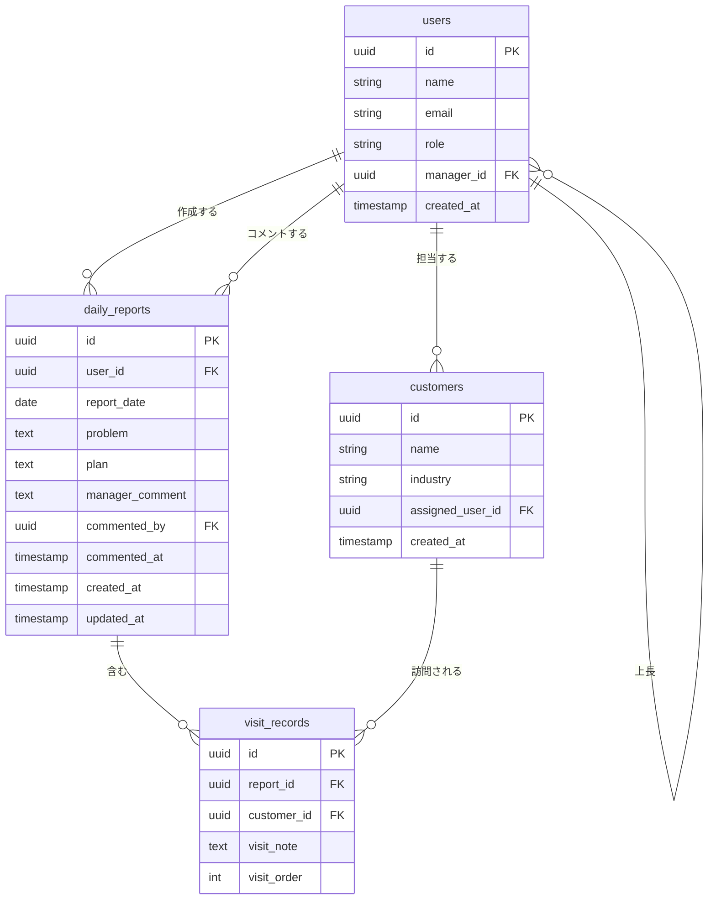

# 営業日報システム ER図

## テーブル一覧

| テーブル名 | 説明 |
|-----------|------|
| `users` | ユーザーマスタ（営業担当者・上長・管理者） |
| `customers` | 顧客マスタ |
| `daily_reports` | 日報本体 |
| `visit_records` | 訪問記録（日報の明細） |

---

## ER図

---

## テーブル定義

### users（ユーザーマスタ）

| カラム名 | 型 | NULL | 説明 |
|---------|-----|------|------|
| `id` | UUID | NOT NULL | 主キー |
| `name` | VARCHAR(50) | NOT NULL | 氏名 |
| `email` | VARCHAR(255) | NOT NULL | メールアドレス（ログインID、ユニーク） |
| `role` | VARCHAR(20) | NOT NULL | ロール（`sales` / `manager` / `admin`） |
| `manager_id` | UUID | NULL | 上長のユーザーID（自己参照FK） |
| `created_at` | TIMESTAMP | NOT NULL | 作成日時 |

### customers（顧客マスタ）

| カラム名 | 型 | NULL | 説明 |
|---------|-----|------|------|
| `id` | UUID | NOT NULL | 主キー |
| `name` | VARCHAR(100) | NOT NULL | 顧客名 |
| `industry` | VARCHAR(100) | NULL | 業種 |
| `assigned_user_id` | UUID | NULL | 担当営業のユーザーID（FK） |
| `created_at` | TIMESTAMP | NOT NULL | 作成日時 |

### daily_reports（日報）

| カラム名 | 型 | NULL | 説明 |
|---------|-----|------|------|
| `id` | UUID | NOT NULL | 主キー |
| `user_id` | UUID | NOT NULL | 作成者のユーザーID（FK） |
| `report_date` | DATE | NOT NULL | 報告日（user_id と合わせてユニーク） |
| `problem` | TEXT | NOT NULL | 課題・相談 |
| `plan` | TEXT | NOT NULL | 明日やること |
| `manager_comment` | TEXT | NULL | 上長コメント |
| `commented_by` | UUID | NULL | コメント投稿者のユーザーID（FK） |
| `commented_at` | TIMESTAMP | NULL | コメント投稿日時 |
| `created_at` | TIMESTAMP | NOT NULL | 作成日時 |
| `updated_at` | TIMESTAMP | NOT NULL | 更新日時 |

### visit_records（訪問記録）

| カラム名 | 型 | NULL | 説明 |
|---------|-----|------|------|
| `id` | UUID | NOT NULL | 主キー |
| `report_id` | UUID | NOT NULL | 日報ID（FK） |
| `customer_id` | UUID | NOT NULL | 顧客ID（FK） |
| `visit_note` | TEXT | NOT NULL | 訪問内容 |
| `visit_order` | INT | NOT NULL | 表示順（1始まり） |
